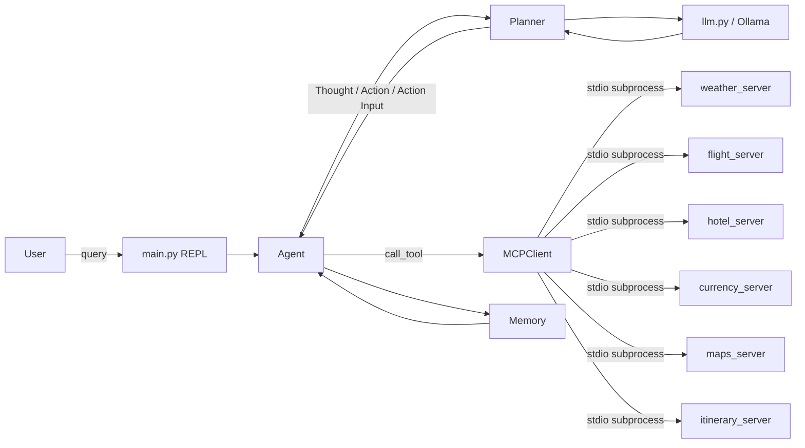

# ✈️ AI Travel Planner

A local, MCP-powered travel-planning agent. A single **ReAct** (Reason + Act)
loop, driven by a local **Ollama** LLM, plans trips by calling out to a set of
independent **MCP (Model Context Protocol)** tool servers — weather, flights,
hotels, currency conversion, points of interest, and itinerary composition —
each running as its own subprocess.

---

## How it works



Each turn, the `Agent` asks the `Planner` for the next step. The `Planner`
builds a prompt (system prompt + tool catalogue + conversation history +
question), sends it to the local LLM, and parses the reply into a structured
`Thought` / `Action` / `Action Input` / `Final Answer` decision. If a tool is
needed, `Agent` calls it through `MCPClient`, which routes the request to
whichever MCP server subprocess registered that tool name, and the result
becomes the next `Observation` fed back into memory.

## Features

- **ReAct agent loop** (`agent/`) — ported from an earlier single-file agent,
  now backed by real MCP tool servers instead of a static in-process tool
  registry.
- **Dynamic tool catalogue** — the system prompt's tool list is generated at
  runtime from whatever MCP servers are actually connected (see
  `mcp_client/tool_catalogue.py`), so enabling a new server never requires
  editing the agent or prompt code.
- **Six independent MCP servers** (`mcp_servers/`), each with a pure,
  mocked-data business-logic function (`provider.py`) separated from its MCP
  wrapper (`server.py`):
  - `weather_server` — mocked forecasts per city
  - `currency_server` — mocked exchange-rate conversion
  - `flight_server` — mocked flight search results
  - `hotel_server` — mocked hotel search results
  - `maps_server` — mocked points of interest
  - `itinerary_server` — composes a day-by-day itinerary from the other four
    servers' results
- **Pluggable server config** (`config.py`) — every server is enabled/disabled
  with a single `enabled: True/False` flag; no other code changes needed to
  add capacity.

## Project structure

```
AI Travel Planner/
├── main.py                    # Entry point / REPL loop
├── config.py                  # Central config: model, steps, MCP_SERVERS
├── agent/
│   ├── agent.py                # ReAct execution loop
│   ├── planner.py               # Prompt building + response parsing
│   ├── memory.py                 # Short-term trajectory memory
│   ├── llm.py                     # Ollama chat wrapper
│   └── prompts/
│       ├── system_prompt.py       # ReAct system prompt (dynamic tool catalogue)
│       └── itinerary_prompt.py
├── mcp_client/
│   ├── transport.py             # stdio subprocess + MCP handshake
│   ├── client.py                  # MCPClient: connect / list_tools / call_tool
│   └── tool_catalogue.py           # Formats tools for the system prompt
├── mcp_servers/
│   ├── weather_server/
│   ├── currency_server/
│   ├── flight_server/
│   ├── hotel_server/
│   ├── maps_server/
│   └── itinerary_server/
├── session/                    # Multi-turn session context (planned)
├── evaluation/                 # End-to-end test scenarios (planned)
└── tests/                      # Unit + MCP client tests
```

## Getting started

### Prerequisites
- Python 3.11+
- [Ollama](https://ollama.com/) installed and running locally, with a model
  pulled (default configured model: `llama3:latest`)
  ```powershell
  ollama pull llama3:latest
  ```

### Install

```powershell
cd "AI Travel Planner"
python -m venv venv
.\venv\Scripts\Activate.ps1
pip install -r requirements.txt
```

### Configure which tools are active

Open `config.py` and flip `enabled` to `True` for any server you want the
agent to have access to:

```python
MCP_SERVERS = {
    "weather": {"command": "python", "args": [...], "enabled": True},
    "currency": {"command": "python", "args": [...], "enabled": False},
    ...
}
```

### Run

```powershell
python main.py
```

```
Ask something (or 'exit'): What's the weather in Tokyo tomorrow?
```

## Testing

```powershell
pytest
```

`tests/test_mcp_client.py` spins up the weather server as a real subprocess
and exercises `MCPClient` through the actual MCP wire protocol (not just a
direct Python import), to confirm the client layer works independently of the
agent.


